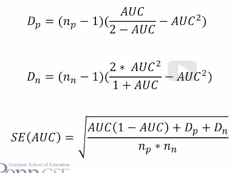

# Diagnostic Metrics - Metrics for Classifiers cont'd

##### ROC:
* You are predicting something which has two values.
* Your prediction model outputs a probability or other real value.
* Take very number and use it as a cut-off with some being classified into each respective category.
* Placing a decision threshold ends in one of four possibilities: true positive, false positive, true negative, false negative.
* An ROC curve plots:
  * x-axis -> Percent false positives vs true negatives.
  * y-axis -> percent true positives vs false negatives.
  

##### AUC ROC (A'):
* Is mathematically equi vent to the Wilcoxon Statistics -> The probability that if the model is given an example from each category, it will accurately identify which is which.
* This is useful for:
  * Whether two AUC values are significantly different
  * Whether the AUC value is significantly different than chance.
* This is not good for more than three models though there are semantic modifications that exist that make it possible.
* Z = (AUC_1 - AUC_2)/(sqrt(SE(AUC_1)^2 + SE(AUC_2)^2))
* Comparing a __single__ model to chance: z = (AUC_1 - 0.5)/sqrt(SE(AUC_1)^2 + 0)
* Standard errors can be computed as follows:

* Complications of this test:
  * This test assumes independence. This assumption is not satisfied in the case of multiple data points from the same student, which is commonly the case. A workaround for this is to compute AUC and significance for each student then integrate across students.
  * There are reasons why you might not want to compute AUC within-student, for example if there is not intra-student variance. 
  * Implementations of AUC remain buggy in many data mining and statistical packages with the exception of a few (e.g. sci-kit and auctestr).

##### AUC and Kappa:
* AUC:
  * More difficult to compute.
  * Only works for two categories.
  * Meaning is invariant across data sets.
  * Very easy to interpret statistically.
  * AUC values are almost always higher than kappa as it takes confidence into account. 

 

##### Precision and Recall:
* Precision = TP/(TP+FP); The probability that a data point classified as true is actually true.
* Recall = TP/(TP+FN); The probability that a data point that is actually true is classified as true.
* Note:
  * False Positive = Type 1 Error
  * False Negative = Type 2 Error

