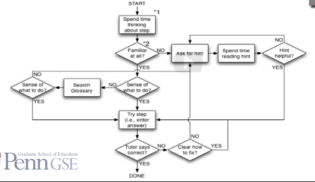
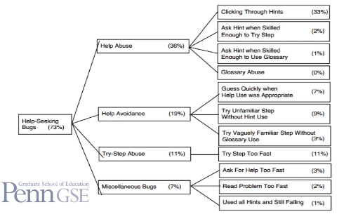

# Knowledge Engineering

##### Classical Version:
* A knowledge engineer and a domain expert work together to model the construct.
* Through an iterative process.
* Where:
  * The knowledge engineer interview the expert
  * Creates models
  * Goes through the mode with expert
  * Get feedback
  * Enhances the models
  * Repeats the process
* Until both the knowledge engineer and domain expert believe the model has fully captured the experts reasoning.

##### A prescriptive model of good help-seeking behavior:

##### A taxonomy of errors in student help-seeking:

##### Knowledge Engineering at its Worst:
* Knowledge engineering are sometimes used to refer to:
  * Someone making up a simple model very quickly.
  * Calling the resultant construct by a well-known name.
  * Not testing on data in any way.
* This achieve poorer construct validity validity.
* Predicts desired constructs poorly, sometimes even worse than chance
